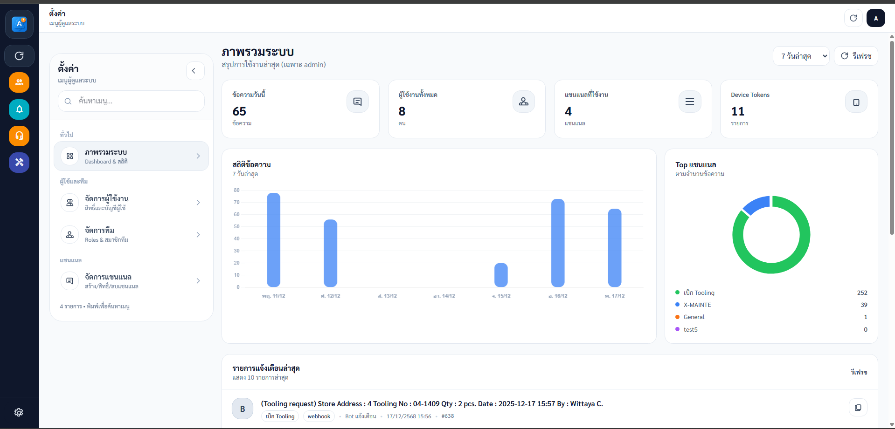
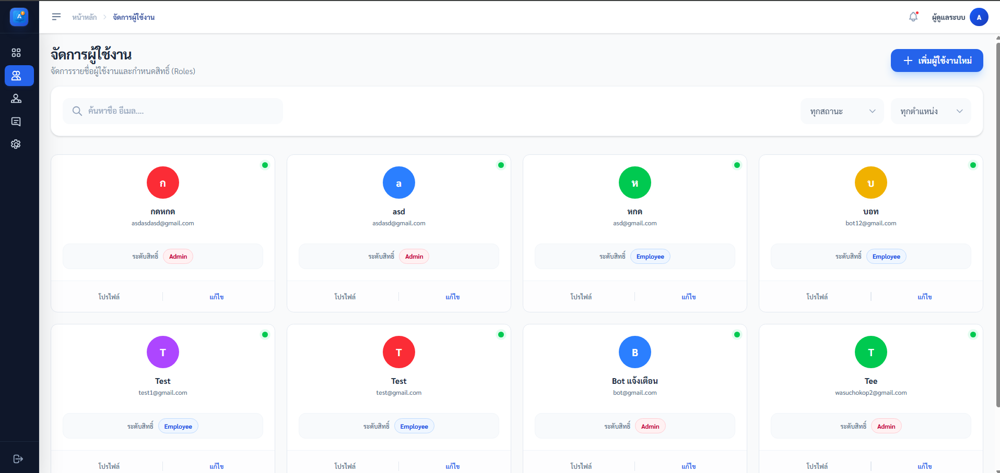
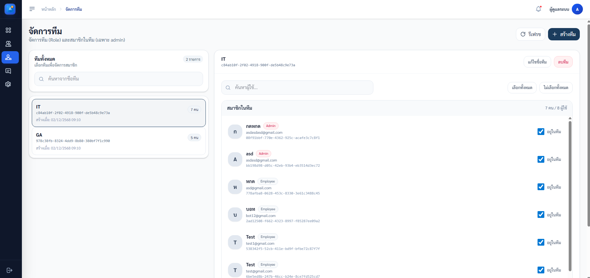
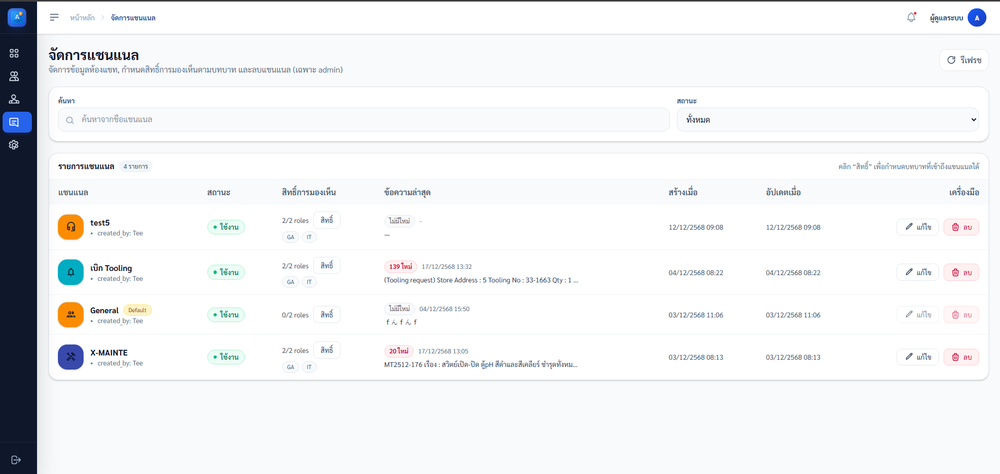

# web-notify

Frontend (Angular) สำหรับระบบ Notify-ATC

## Screenshots

<p>
  
  
</p>
<p>
  
  
</p>

## Quickstart

- Node.js + npm (repo ใช้ `npm@10.x`)

```bash
cd web-notify
npm install
npm run start
```

Dev server: `http://localhost:4200`

```bash
cd web-notify
npm run build
```

## Config (API Base URL)

ค่า default ของ API คือ `http://localhost:3300/api/v1` (ดูที่ `web-notify/src/app/core/config/api.config.ts`)

Override ได้ด้วย env var ตอนรัน:

- `NG_APP_API_URL`
- `NG_APP_API_BASE`

ตัวอย่าง (PowerShell):

```powershell
$env:NG_APP_API_URL="http://10.17.3.244:3300/api/v1"
npm run start
```

## Admin

- Routes หลัก: `/admin/dashboard`, `/admin/users`, `/admin/channels`, `/admin/teams`

## Notes

- `MaterialIcons-Regular.otf` ใช้เพื่อให้ `icon_codepoint` ตรงกับ Flutter
- Assets: `public/` และ `src/assets/` (ดู `web-notify/angular.json`)
z